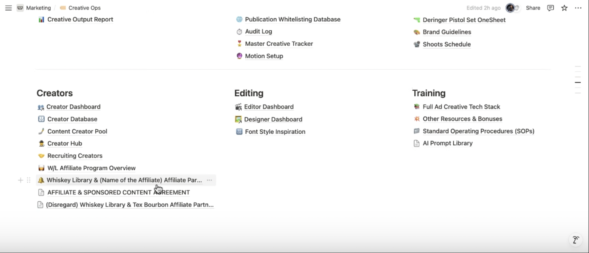
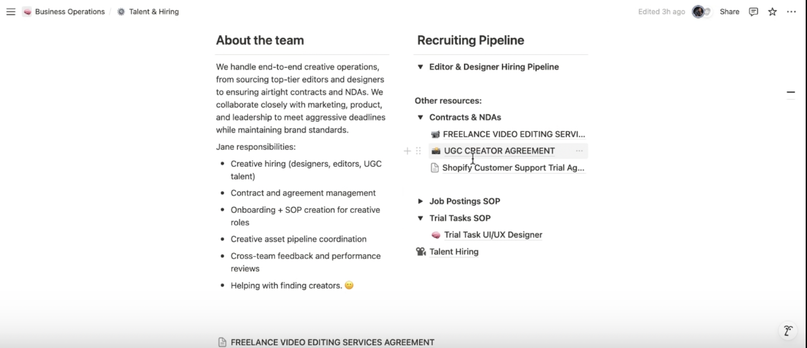
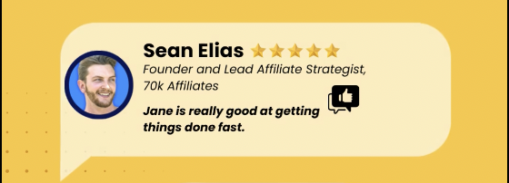
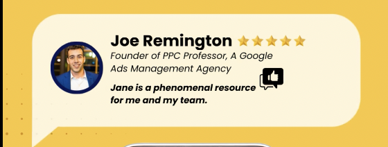

  

<h1 align="center" style="margin-bottom:0;">Jane Yugtan</h1>

<b>Project Manager & Executive Assistant</b>

  <a href="#results">Results</a> ·
  <a href="#core-focus">Core Focus</a> ·
  <a href="#demos">Demos</a> ·
  <a href="#experience">Experience</a> ·
  <a href="#clients">Clients</a> ·
  <a href="#testimonials">Testimonials</a> ·
  <a href="#certifications">Certifications</a> ·
  <a href="#contact">Contact</a>

  <a href="https://calendly.com/jyugtan/discovery-call-with-jane" target="_blank" rel="noopener" aria-label="Book a quick virtual coffee">☕ Book a quick virtual coffee</a>

  
  
  

<i>I translate founder vision into systems, sprints, and measurable outcomes across Marketing, Web, and Ops. Formal, metrics-driven, and results-focused.</i>

## 🔎 Results at a Glance
- **$10K+** affiliate revenue in the **first 30 days** (zero ad spend)
- **-87%** onboarding time (**3 days → 4 hours**)
- **95%** new-hire satisfaction (from ~60%)
- **-30%** project delays via ClickUp QA gates & automation
- **5–6 hrs/mo** founder time saved with reporting & status automation

<a href="#top">Back to top ↑</a>

## 🧭 Core Focus — PM & EA
**Project Management**
- Roadmaps → sprints → QA in **ClickUp** and **Notion**
- SOPs, RACI, risk registers, and KPI dashboards for predictable throughput

**Executive Assistant**
- Inbox & calendar control; stakeholder comms; meeting notes → actionable tasks
- Renewal hygiene, structured follow-ups, and executive-ready reporting cadence

<a href="#top">Back to top ↑</a>

## 🎬 Demo Walkthroughs

  <!-- Affiliate Program — Notion + GoHighLevel -->
  <a href="https://www.loom.com/share/f883c45c953848fca179d3bc8724875f?sid=d8f6f443-d770-473d-b4ae-b3fe70d53e16" style="flex:1 1 360px; text-decoration:none; color:#0f172a;" aria-label="Watch Affiliate Program demo">
    

      

        
        ▶
      

      

        
Affiliate Program — Notion &amp; GoHighLevel

        

          <b>Outcome:</b> Scaled to <b>$12K</b> with <b>$0 ad spend</b>; replaced spreadsheets with a data-driven pipeline; saved CEO ~<b>2 hrs/week</b>.
        

        <ul style="margin:0 0 10px 18px; color:#334155; font-size:14px;">
          <li>Automated status, payouts, and comms</li>
          <li>“Affiliate Playbook” SOPs for repeatable execution</li>
          <li>Clean handoffs across marketing & ops</li>
        </ul>
        ▶ Watch demo
      

    

  </a>

  <!-- Talent & Hiring Pipeline — Notion -->
  <a href="https://www.loom.com/share/5aa9f903245a482dbbebb103931f1408?sid=c71648f4-3d88-49a5-bed6-65d787dd9dfe" style="flex:1 1 360px; text-decoration:none; color:#0f172a;" aria-label="Watch Talent & Hiring Pipeline demo">
    

      

        
        ▶
      

      

        
Talent &amp; Hiring Pipeline — Notion

        

          <b>Outcome:</b> Onboarding compressed from ~<b>3 days → 4 hours</b>; removed last-minute approvals with stages & automations.
        

        <ul style="margin:0 0 10px 18px; color:#334155; font-size:14px;">
          <li>Role scorecards, structured interviews, offer templates</li>
          <li>Automated candidate comms and status transitions</li>
          <li>“Hiring Playbook” for repeatable onboarding</li>
        </ul>
        ▶ Watch demo
      

    

  </a>

<a href="#top">Back to top ↑</a>

## 🗂 Experience (Selected)
### Project Manager — <b>Whiskey Library</b> <i>(2025)</i>
- Launched data-driven affiliate engine: **$10K+ in 30 days**
- Automated outreach & tracking; onboarding time **-87%**
- **-30%** delays; **5–6 hrs/mo** founder time saved

### Project Manager — <b>ServiceThrive</b> <i>(2024–2025)</i>
- Built execution plans and QA; improved delivery productivity
- Proposed scalable systems; removed operational blockers

### Project Manager — <b>The Social Brand</b> <i>(2023–2024)</i>
- Managed 6 full-stack web & SEO projects (avg. **1.8 months** to launch)
- Reduced rework **-30%** via ClickUp-first QA; **95% CSAT** on updates

### EA / OBM — <b>Investor Attraction Academy</b> <i>(2023–2024)</i>
- Founder support (inbox/calendar, client comms, scheduling)
- Automated sequences; maintained SLAs & satisfaction

<a href="#top">Back to top ↑</a>

## 🤝 Clients & Websites Managed

  <!-- keep logos light with consistent treatment -->
  
  
  
  

  
  
  
  
  

  
  
  
  
  

  
  

<a href="#top">Back to top ↑</a>

## 🎥 Testimonials

  <!-- SEAN ELIAS -->
  <a href="./Sean%20Elias-TestimonialVideo.mp4" style="flex:1 1 340px; text-decoration:none; color:#0f172a;" aria-label="Watch testimonial from Sean Elias">
    

      

        
      

      

        
Sean Elias — Threecolts / 70K Affiliates

        
“Jane is really good at getting things done fast.”

        ▶ Watch video
      

    

  </a>

  <!-- JOE REMINGTON -->
  <a href="./Joe-Remington-TestimonialVideo.mp4" style="flex:1 1 340px; text-decoration:none; color:#0f172a;" aria-label="Watch testimonial from Joe Remington">
    

      

        
      

      

        
Joe Remington — PPC Professor

        
“Jane is a phenomenal resource for me and my team.”

        ▶ Watch video
      

    

  </a>

<a href="#top">Back to top ↑</a>

## 🏅 Certifications

  
    
    
<b>ClickUp Verified Power User (v3)</b> — 2025

  
  
    
    
<b>HubSpot SEO Certification</b> — 2024

  

<a href="#top">Back to top ↑</a>

## 📬 Contact

  <a href="https://calendly.com/jyugtan/discovery-call-with-jane" style="display:inline-block; padding:12px 16px; background:#1a1a2e; color:#fff; text-decoration:none; border-radius:12px; font-weight:700;">☕ Book a quick virtual coffee</a>

© 2025 Jane Yugtan — Project Manager & Executive Assistant

