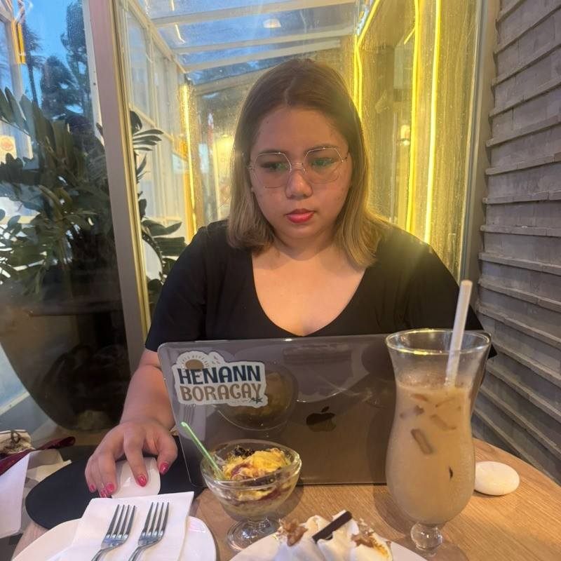
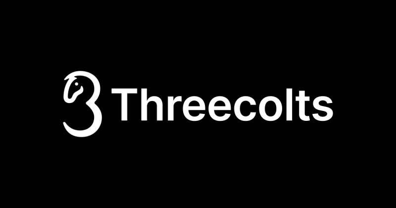
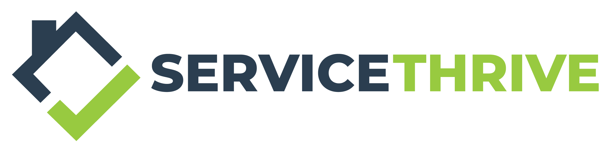
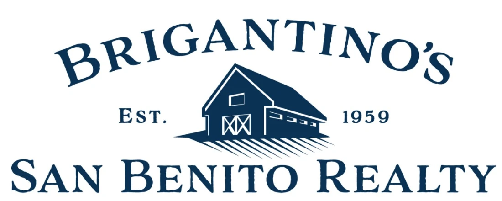
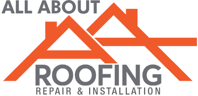
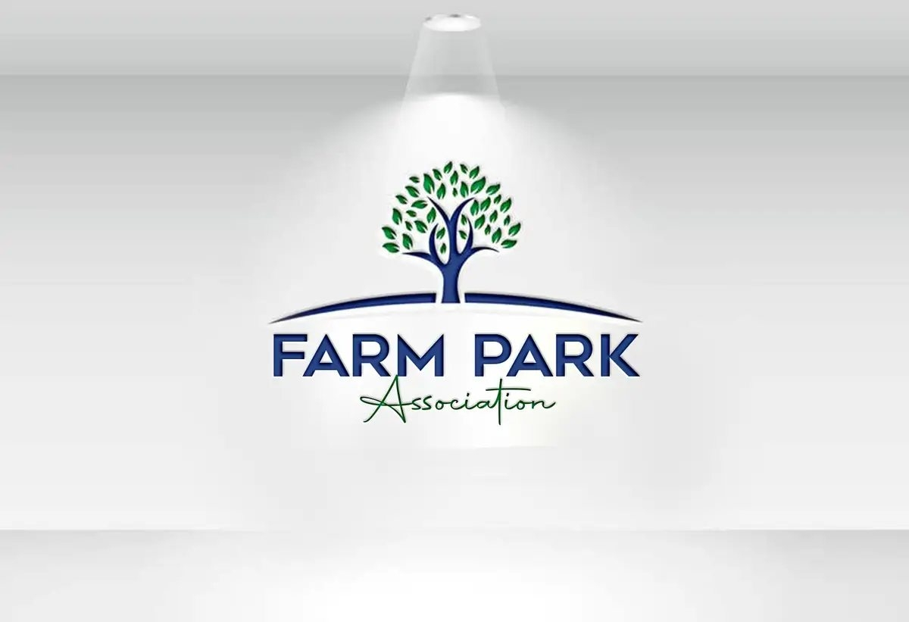
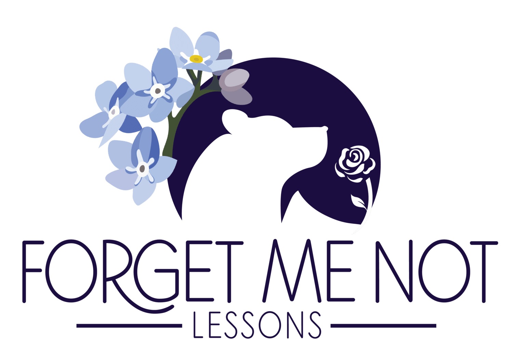
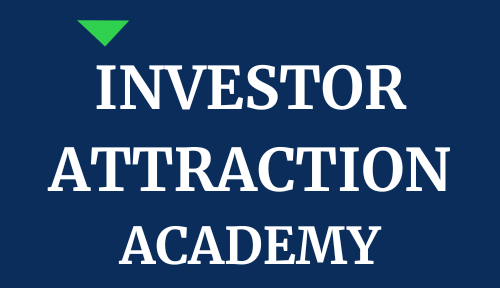

  

  **Jane Yugtan**
    **Project Manager & Executive Assistant**

   

  I turn founder vision into systems, sprints, and measurable results across Marketing, Web, and Ops. Formal, metrics-driven, and outcomes-focused.

---

## 🔎 Results at a Glance
- **$10K+** affiliate revenue in the **first 30 days** (zero ad spend).
- **-87%** onboarding time (3 days → **4 hours**).
- **95%** new-hire satisfaction (from ~60%).
- **-30%** project delays via ClickUp QA gates and automation.
- **5–6 hrs/mo** founder time saved with reporting and status automation.

---

## 🧭 Core Focus — PM & EA
**Project Management**
- Roadmaps → sprints → QA in **ClickUp** and **Notion**.
- SOPs, RACI, risk flags, and KPI dashboards to keep throughput predictable.

**Executive Assistant**
- Inbox & calendar control, stakeholder comms, meeting notes → tasks.
- Renewal hygiene, structured follow-ups, and executive-ready reports.

---

## 🗂 Experience (Selected)
### Project Manager — **Whiskey Library** *(2025)*
- Launched data-driven affiliate engine: **$10K+ in 30 days**.
- Automated outreach & tracking; onboarding time **-87%**.
- **-30%** delays; **5–6 hrs/mo** founder time saved.

### Project Manager — **ServiceThrive** *(2024–2025)*
- Built execution plans and QA; improved delivery productivity.
- Proposed scalable systems; removed operational blockers.

### Project Manager — **The Social Brand** *(2023–2024)*
- Managed 6 full-stack web & SEO projects (avg. **1.8 months** to launch).
- Reduced rework **-30%** via ClickUp-first QA; **95% CSAT** on updates.

### EA / OBM — **Investor Attraction Academy** *(2023–2024)*
- Founder support (inbox/calendar, client comms, scheduling).
- Automated sequences; maintained SLAs & satisfaction.

---

## 🤝 Clients & Websites Managed

  
  
  
  
  
  
  
  
  
  
  
  
  
  
  
  
  

---

## 🎥 Testimonials
- **Sean Elias** — Threecolts / 70K Affiliates → [`Play Video`](./Sean%20Elias-TestimonialVideo.mp4)  
- **Joe Remington** — PPC Professor → [`Play Video`](./Joe-Remington-TestimonialVideo.mp4)

---

## 🏅 Certifications

  
  

---

## 💬 Contact

