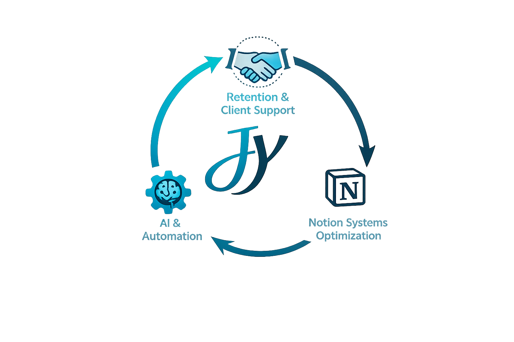
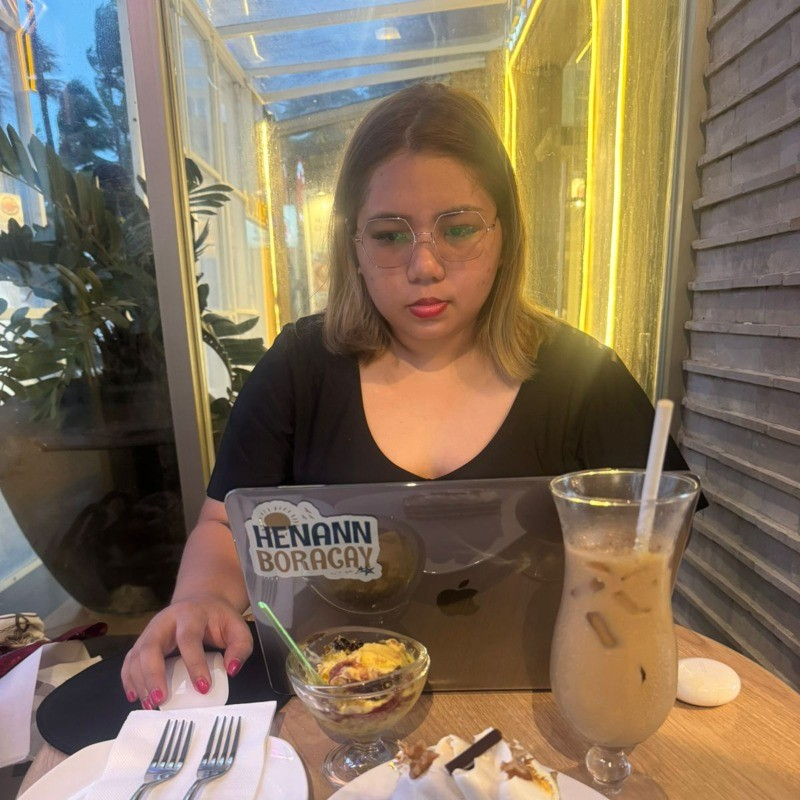
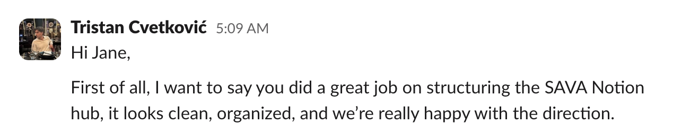
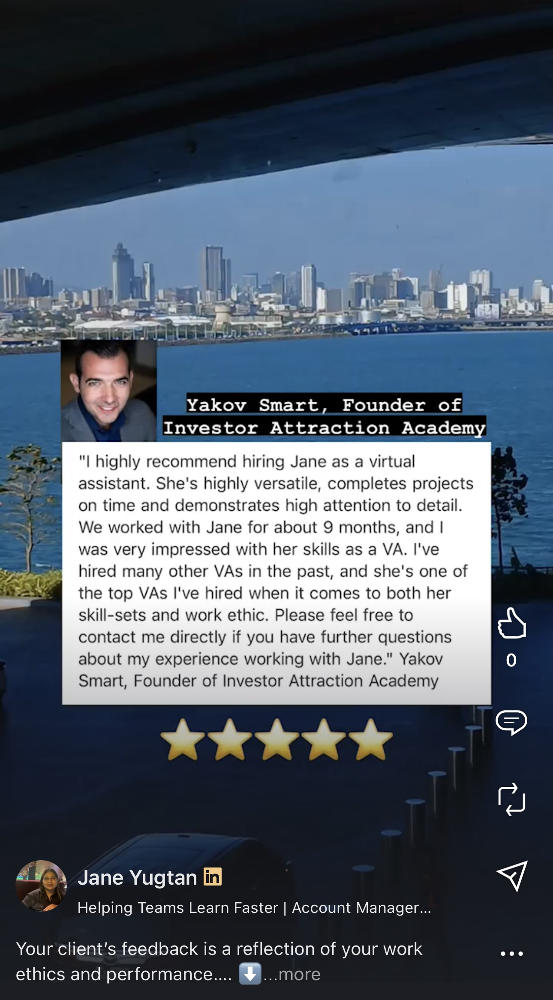

<html lang="en">
<head>
<meta charset="UTF-8" />
<meta name="viewport" content="width=device-width, initial-scale=1.0" />
<title>Jane Yugtan | Account Manager Portfolio | Project Manager | Executive Assistant</title>
<meta name="description" content="Portfolio of Jane Yugtan — Account Manager, Project Manager, and Executive Assistant helping founders and agencies improve client retention, streamline operations, build Notion systems, and automate workflows." />
<meta name="keywords" content="Jane Yugtan, Account Manager Portfolio, Project Manager Portfolio, Executive Assistant Portfolio, Notion Systems, Client Retention, Operations Support, Automation" />
<meta name="author" content="Jane Yugtan" />
<meta name="robots" content="index, follow" />
<link rel="canonical" href="https://janeyugtan.com/" />
<meta property="og:title" content="Jane Yugtan | Account Manager Portfolio" />
<meta property="og:description" content="Helping founders and agencies improve client retention, operations, systems, and workflow automation." />
<meta property="og:type" content="website" />
<meta property="og:url" content="https://janeyugtan.com/" />
<meta property="og:image" content="intro-cover.jpg" />
<meta name="twitter:card" content="summary_large_image" />
<meta name="twitter:title" content="Jane Yugtan | Account Manager Portfolio" />
<meta name="twitter:description" content="Account Manager, Project Manager, and Executive Assistant portfolio." />
<meta name="twitter:image" content="intro-cover.jpg" />
<link rel="apple-touch-icon" sizes="180x180" href="apple-touch-icon.png" />
<link rel="icon" type="image/png" sizes="32x32" href="favicon-32x32.png" />
<link rel="icon" type="image/png" sizes="16x16" href="favicon-16x16.png" />
<link rel="manifest" href="site.webmanifest" />
<link rel="preconnect" href="https://fonts.googleapis.com" />
<link rel="preconnect" href="https://fonts.gstatic.com" crossorigin />
<link href="https://fonts.googleapis.com/css2?family=DM+Sans:ital,opsz,wght@0,9..40,400;0,9..40,500;0,9..40,700;0,9..40,800;1,9..40,400&family=DM+Serif+Display&display=swap" rel="stylesheet" />

</head>
<body>

Currently accepting part-time clients (EST hours) — Book a quick call to see if we're a fit

<nav class="nav" id="mainNav">
<a href="#video-intro" data-section="video-intro">Video</a>
<a href="#results" data-section="results">Results</a>
<a href="#services" data-section="services">Services</a>
<a href="#featured-projects" data-section="featured-projects">Projects</a>
<a href="#pricing" data-section="pricing">Ways I Work</a>
<a href="#testimonials" data-section="testimonials">Testimonials</a>
<a href="#about" data-section="about">About</a>
</nav>

<main class="container">

<section class="hero" id="top">

Client RetentionNotion SystemsRevenue OperationsAutomation
Project DeliveryAccount ManagementClient RetentionNotion Systems
Revenue OperationsAutomationProject DeliveryAccount Management

Client Retention • Systems • Revenue Operations

<h1>Jane Yugtan</h1>

Account Manager | Project Manager | Executive Assistant

I help founders, agencies, and B2B teams strengthen client retention, improve delivery, streamline operations, and support revenue growth through account management, renewals, Notion systems, and practical automation.

<a class="btn btn-primary" href="https://calendly.com/jyugtan/discovery-call-with-jane" target="_blank" rel="noopener">☕ Book a quick virtual coffee</a>
<a class="btn btn-secondary" href="mailto:jane@janeyugtan.com">📩 Email Me</a>
<a class="btn btn-light" href="https://www.linkedin.com/in/jyugtan/" target="_blank" rel="noopener">🔗 LinkedIn</a>

</section>

<section class="section reveal" id="video-intro">
<h2 class="section-title">🎥 Meet Jane</h2>

This short introduction gives you a quick overview of my work, the teams I support, and what you'll find in this portfolio.

▶

Watch My Introduction

<h3>A quick introduction to my work</h3>

In this short video, I share a quick overview of my background, the work I do across account management, project delivery, and systems, and what you can expect to see throughout this portfolio.

</section>

<section class="section reveal" id="results">
<h2 class="section-title">🔎 Results at a Glance</h2>

A snapshot of the results I've delivered across account management, operations, and systems work.

$100K+

Enterprise renewals processed

Managed high-value renewals with a focus on retention, continuity, and account health.

135K+

Global subscribers reached

Included as an account manager in subscriber-facing communications for a global B2C audience.

$10K

Affiliate pipeline in 30 days

Built a qualified affiliate pipeline and supporting workflow for Whiskey Library in the first 30 days.

-87%

Onboarding time reduced

Reduced onboarding from about 3 days to 4 hours through clearer systems and automation.

95%

Workflow satisfaction improvement

Improved team experience through clearer systems, better visibility, and stronger documentation.

-30%

Project delays reduced

Improved execution through QA gates, clearer process control, and more predictable delivery.

6–10 hrs

CEO time saved weekly

Clearer systems, structured workflows, and automation freed up leadership time each week.

100+

Client accounts supported

Supported delivery and operations across agencies, founders, and the clients they served.

🔎

<h3>$100K+ in enterprise renewals</h3>

This reflects high-value renewal work tied to retention, account continuity, and client relationships.

<button class="metric-close" id="renewalsCalloutClose" type="button">Close highlight</button>

</section>

<section class="section reveal" id="services">
<h2 class="section-title">🛠 Services</h2>

Here are the main ways I support founders, agencies, and growing teams.

Retention

<h3>Account Management & Client Retention</h3>
<ul>
<li>Enterprise renewals and retention support</li>
<li>Client communication, follow-up, and relationship management</li>
<li>Revenue-focused coordination for ongoing accounts</li>
</ul>

RenewalsRetentionClient Success

Systems

<h3>Notion Dashboard Optimization</h3>
<ul>
<li>Company-wide Notion setup and dashboard cleanup</li>
<li>Department dashboards, SOP libraries, and KPI systems</li>
<li>Systems that improve visibility, consistency, and day-to-day use</li>
</ul>

Notion SystemsOperationsDocumentation

Automation

<h3>AI + Automation for Agencies & B2B Teams</h3>
<ul>
<li>AI-assisted outreach workflows for B2B companies</li>
<li>Automation of repetitive admin, reporting, and coordination work</li>
<li>Process improvement for agencies and contractor-focused businesses</li>
</ul>

AI WorkflowsAutomationB2B Outreach

</section>

<section class="section reveal" id="featured-projects">
<h2 class="section-title">📌 Featured Projects</h2>

These two projects give a clear view of how I approach systems, execution, and growth support.

https://sava-amsterdam.com/

🌐 Live Website

<a href="https://www.loom.com/share/3055c23d989b440b89c32c487e5de84e" target="_blank" rel="noopener" class="btn btn-light">🎥 System Walkthrough ↗</a>

<h3>SAVA Amsterdam</h3>

Full company Notion system

A company-wide Notion system built for cleaner operations, stronger visibility, and a more scalable workspace.

E-commerce OpsCompany Systems

https://whiskeylibrary.com/

🌐 Live Website

<a href="https://www.loom.com/share/f883c45c953848fca179d3bc8724875f" target="_blank" rel="noopener" class="btn btn-light">🎥 System Walkthrough ↗</a>

<h3>Whiskey Library</h3>

$10K pipeline in 30 days

An affiliate pipeline and Notion workflow built to support early-stage growth, visibility, and a more organized affiliate operation.

Affiliate OpsNotion Workflow

</section>

<section class="section reveal" id="pricing">
<h2 class="section-title">💼 Ways I Work With Clients</h2>

I work with clients on a part-time or project basis. Rates are discussed during our discovery call based on scope and fit.

<button class="carousel-arrow left" type="button" id="pricingPrev" aria-label="Previous">‹</button>

Flexible Support

<h3>Hourly Support</h3>

For ongoing operational, project, or account management support.

<ul><li>Ideal for agencies and founders needing flexible, reliable support</li><li>No long-term commitment required</li></ul>

💬 Rate discussed on call

Systems Build

<h3>Notion System Projects</h3>

Company-wide Notion dashboards, operations systems, and workflow design.

<ul><li>Includes planning, system design, and implementation</li><li>Scoped per project</li></ul>

💬 Scoped on call

Ongoing Partnership

<h3>Maintenance & Retainers</h3>

Post-project maintenance, optimization, and system support.

<ul><li>Monthly partnership for ongoing updates and refinements</li><li>Ideal for teams wanting a consistent right hand</li></ul>

💬 Rate discussed on call

Strategy

<h3>Consulting Sessions</h3>

Strategic sessions focused on systems, operations, and workflow optimization.

<ul><li>Includes a follow-up SOP or action guide</li><li>Great for founders who want direction before committing to a build</li></ul>

💬 Rate discussed on call

<button class="carousel-arrow right" type="button" id="pricingNext" aria-label="Next">›</button>

<svg viewBox="0 0 24 24" fill="none" stroke="currentColor" stroke-width="2"><path d="M5 12h14M12 5l7 7-7 7"/></svg>
Swipe to see more options
<svg viewBox="0 0 24 24" fill="none" stroke="currentColor" stroke-width="2"><path d="M19 12H5M12 19l-7-7 7-7"/></svg>

</section>

<section class="section reveal" id="testimonials">
<h2 class="section-title">🎥 What Clients Say</h2>

Video testimonials and direct feedback from founders and teams I've worked with.

▶

Video Testimonial

Sean Elias — Threecolts / 70K Affiliates

★★★★★

"Jane is really good at getting things done fast."

<a class="btn btn-secondary" href="./Sean%20Elias-TestimonialVideo.mp4" style="font-size:13px;padding:10px 14px;">▶ Watch Video</a>

▶

Video Testimonial

Joe Remington — PPC Professor

★★★★★

"Jane is a phenomenal resource for me and my team."

<a class="btn btn-secondary" href="./Joe-Remington-TestimonialVideo.mp4" style="font-size:13px;padding:10px 14px;">▶ Watch Video</a>

<h3 style="font-family:'DM Serif Display',serif;font-size:22px;margin:0 0 6px;">📋 Client Feedback</h3>

Direct messages and posts from clients I've worked with.

💬 Direct Message
SAVA Amsterdam — Notion Project

🔍 Click to enlarge

Feedback from the SAVA Amsterdam Notion system project

in LinkedIn
Yakov — Former Client

🔍 Click to enlarge

LinkedIn post — <a href="https://www.linkedin.com/posts/jyugtan_virtualassistant-digitalserviceprovider-ugcPost-7190863868208771072-QcKw" target="_blank" rel="noopener" style="color:var(--blue);font-weight:700;">View on LinkedIn ↗</a>

</section>

<section class="section reveal" id="about">
<h2 class="section-title">👋 About Me</h2>

A little about how I got started and what keeps me interested in this work.

My Story

<h3>Working remotely since 2021</h3>

I started working remotely in 2021, and in 2022 I landed my first real project supporting a marketing agency in the United States. Since then everything shifted.

Over the past few years, I've helped marketing agencies and founders improve operations, organize systems, and support client relationships. Along the way, I've worked with around <strong>10 clients</strong> and indirectly supported <strong>100+ of their clients</strong> through project delivery, systems work, and account management.

Today, I focus on helping teams save time, streamline processes, and build systems that make day-to-day work easier.

Current Focus

<h3>What I'm focused on right now</h3>
<!-- SAFE VERSION: no employer name, no role title, no industry specifics that could identify current job -->

My day-to-day work keeps me sharp across client relationships, account continuity, and operational support — which is exactly what I bring to the projects I take on here.

I'm selectively open to <strong>part-time engagements</strong> where I can make a real impact — whether that's tightening up operations, keeping clients retained, or building systems that actually get used.

If the scope is right and the timing works, I'd love to connect.

Fun Fact

<h3>Life outside work</h3>

I love traveling around the Philippines, especially beach destinations. I enjoy sunsets, good conversations, and ending the day with a cocktail.

I also love cats and exploring new places around my country. Working remotely lets me do work I enjoy while still experiencing the world around me.

</section>

<section class="section reveal" id="contact">

 Currently accepting part-time clients

<h3>Let's build something that actually works.</h3>

If you need someone who can hold the operations together, keep clients happy, and get things done without hand-holding — let's talk.

<a class="btn btn-light" href="https://calendly.com/jyugtan/discovery-call-with-jane" target="_blank" rel="noopener" style="font-size:15px;padding:14px 22px;">☕ Book a discovery call</a>
<a class="btn" href="mailto:jane@janeyugtan.com" style="background:rgba(255,255,255,.12);color:#fff;border:1px solid rgba(255,255,255,.2);font-size:15px;padding:14px 22px;">📩 Send me an email</a>

EST hours · Remote · Part-time engagements welcome

</section>

© 2026 Jane Yugtan — Account Manager | Project Manager | Executive Assistant

</main>

<button class="project-modal-close" id="introVideoModalClose" aria-label="Close intro video">×</button>

Meet Jane

<h3 style="margin-bottom:8px;">A quick introduction to my portfolio</h3>

This short video gives a quick overview of who I am, the work I do, and what you'll find in this portfolio.

<iframe id="introVideoFrame" src="" title="Jane portfolio introduction video" allowfullscreen style="position:absolute;inset:0;width:100%;height:100%;border:0;"></iframe>

<button class="project-modal-close" id="projectModalClose" aria-label="Close project details">×</button>

<button class="lightbox-close" id="lightboxClose" aria-label="Close image">×</button>

</body>
</html>
