<html lang="en">
<head>
  <meta charset="UTF-8" />
  <meta name="viewport" content="width=device-width, initial-scale=1.0" />
  <title>Jane Yugtan | Account Manager | Project Manager | Executive Assistant</title>
  
</head>
<body>
  

    

      
Jane Yugtan

      <nav class="nav">
        <a href="#video-intro">Video</a>
        <a href="#results">Results</a>
        <a href="#services">Services</a>
        <a href="#featured-projects">Projects</a>
        <a href="#experience">Experience</a>
        <a href="#clients">Clients</a>
        <a href="#testimonials">Testimonials</a>
        <a href="#linkedin">LinkedIn</a>
        <a href="#contact">Contact</a>
      </nav>
    

  

  <main class="container">
    <section class="hero" id="top">
      

        

          
        

        

          
Client Retention • Systems • Revenue Operations

          <h1>Jane Yugtan</h1>
          
Account Manager | Project Manager | Executive Assistant

          

            I help founders, agencies, and B2B teams improve client retention, strengthen delivery systems, automate operations, and support revenue growth through account management, enterprise renewals, Notion systems, and AI-powered workflows.
          

          

            <a class="btn btn-primary" href="https://calendly.com/jyugtan/discovery-call-with-jane" target="_blank" rel="noopener">☕ Book a quick virtual coffee</a>
            <a class="btn btn-secondary" href="mailto:yugtanlynette@gmail.com">📩 Email Me</a>
            <a class="btn btn-light" href="https://www.linkedin.com/in/jyugtan/" target="_blank" rel="noopener">🔗 LinkedIn</a>
          

        

      

    </section>

    <section class="section" id="video-intro">
      <h2 class="section-title">🎥 Meet Jane</h2>
      
A quick introduction to how I support enterprise accounts, founders, and growing teams through client success, operational systems, and project execution.

      

        <a class="video-thumb" href="https://www.loom.com/share/6325ce02a04148188bf5de8a8e26732b?sid=54f70cf0-e26a-4e4c-9abf-9808cce40351" target="_blank" rel="noopener" aria-label="Watch Jane's introduction video">
          
          
▶

        </a>
        

          <h3>Client-facing strategy with systems that actually get used</h3>
          

            This introduction highlights my approach to account management, delivery support, automation, and founder operations — with a strong emphasis on communication, follow-through, and measurable outcomes.
          

        

      

    </section>

    <section class="section" id="results">
      <h2 class="section-title">🔎 Results at a Glance</h2>
      
A cleaner KPI layout to highlight the outcomes most relevant to account management, renewals, automation, and systems design.

      

        

          
$100K+

          
Enterprise renewals processed

          
Managed renewal processing across high-value subscription accounts with a focus on retention, continuity, and account health.

        

        

          
64.3%

          
Renewal close rate

          
Based on 18 closed renewals out of 28 tracked renewal decisions.

        

        

          
185K+

          
Global subscribers reached

          
Included as an account manager in subscriber-facing email communications for a large global B2C audience.

        

        

          
$10K

          
Affiliate pipeline in 30 days

          
Built a qualified affiliate pipeline and supporting workflow structure for Whiskey Library in the first 30 days.

        

        

          
-87%

          
Onboarding time reduced

          
Reduced onboarding from approximately 3 days to 4 hours through structured systems and automation.

        

        

          
95%

          
Workflow satisfaction improvement

          
Supported stronger team experience through cleaner systems, visibility, and documentation.

        

        

          
-30%

          
Project delays reduced

          
Improved execution through QA gates, process control, and more predictable delivery workflows.

        

        

          
5–6 hrs

          
Founder time saved monthly

          
Freed up leadership time with better reporting, status visibility, and workflow automation.

        

      

      

        
🔎

        

          <h3>$100K+ in enterprise renewals</h3>
          

            This metric reflects renewal processing across high-value subscription accounts, with a strong focus on revenue retention, account continuity, and client relationship management. Click the KPI card again or use the button below to minimize this view.
          

          <button class="metric-close" id="renewalsCalloutClose" type="button">Close highlight</button>
        

      

    </section>

    <section class="section" id="services">
      <h2 class="section-title">🛠 Services</h2>
      
Focused service lines aligned with your current positioning: client retention, systems optimization, and automation support.

      

        

          <h3>Account Management & Client Retention</h3>
          <ul>
            <li>Enterprise renewals and retention support</li>
            <li>Client communication, follow-up, and relationship management</li>
            <li>Revenue-focused coordination for ongoing accounts</li>
          </ul>
          

            Renewals
            Retention
            Client Success
          

        

        

          <h3>Notion Dashboard Optimization</h3>
          <ul>
            <li>Company-wide Notion architecture and dashboard cleanup</li>
            <li>Department dashboards, SOP libraries, and KPI systems</li>
            <li>Founder-friendly systems that improve visibility and usability</li>
          </ul>
          

            Notion Systems
            Operations
            Documentation
          

        

        

          <h3>AI + Automation for Agencies & B2B Teams</h3>
          <ul>
            <li>AI-assisted outreach workflows for B2B companies and organizations</li>
            <li>Automation of repetitive admin, reporting, and coordination work</li>
            <li>Process improvement for agencies and contractor-focused businesses</li>
          </ul>
          

            AI Workflows
            Automation
            B2B Outreach
          

        

      

    </section>

    <section class="section" id="featured-projects">
      <h2 class="section-title">📌 Featured Projects</h2>
      
A tighter project section focused on your strongest and most relevant case studies.

      

        

          
Featured Project

          <h3>SAVA Amsterdam — Company-Wide Notion Dashboard Optimization</h3>
          

            Designed a full Notion optimization structure for an e-commerce company to turn its workspace into a clean, scalable operating system for the entire business.
          

          <ul>
            <li>Structured company-wide dashboards across Sales, Customer Support, HR, Supply Chain, and Marketing</li>
            <li>Centralized SOPs, KPIs, and team resources into one searchable system</li>
            <li>Improved usability with a founder-friendly layout designed for visibility and adoption</li>
            <li>Built a system intended to help teams find what they need faster and operate more consistently</li>
          </ul>
          

            E-commerce Ops
            Workspace Design
            Company Systems
          

        

        

          
Featured Project

          <h3>Whiskey Library — Affiliate Pipeline & Notion Workflow Build</h3>
          

            Launched a data-driven affiliate engine focused on generating qualified affiliates and building a pipeline valued at <strong>$10,000 in the first 30 days</strong>.
          

          <ul>
            <li>Created a Notion-based workflow to manage affiliate operations, tracking, and visibility</li>
            <li>Built structure for a more organized affiliate pipeline and operational follow-through</li>
            <li>Supported a cleaner process for affiliate onboarding, coordination, and execution</li>
            <li>Focused on turning early-stage affiliate efforts into a trackable revenue pipeline</li>
          </ul>
          

            Affiliate Operations
            Pipeline Build
            Notion Workflow
          

        

      

    </section>

    <section class="section" id="experience">
      <h2 class="section-title">🗂 Experience</h2>
      
Selected experience across account management, project delivery, founder support, and operational systems.

      

        

          
Current Role

          <h3>Account Manager — E-Learning Provider / Enterprise Subscription Accounts</h3>
          <ul>
            <li>Processed <strong>$100,000+</strong> in renewals across high-value enterprise subscription accounts</li>
            <li>Achieved a <strong>64.3% renewal close rate</strong> based on tracked renewal decisions</li>
            <li>Closed <strong>18</strong> renewal accounts while supporting retention and continuity across the pipeline</li>
            <li>Included as an account manager in communications sent to <strong>185,000+</strong> global B2C subscribers</li>
            <li>Focused on client relationships, renewal follow-up, revenue retention, and account continuity</li>
          </ul>
        

        

          
2025

          <h3>Project Manager — Whiskey Library</h3>
          <ul>
            <li>Launched a data-driven affiliate engine generating qualified affiliates and a <strong>$10,000 pipeline</strong> in the first 30 days</li>
            <li>Created a <strong>Notion-based workflow</strong> to support affiliate operations and process visibility</li>
            <li>Improved structure for affiliate management, tracking, and operational execution</li>
          </ul>
        

        

          
2024–2025

          <h3>Project Manager — ServiceThrive</h3>
          <ul>
            <li>Built execution plans, QA process improvements, and workflow structures for delivery support</li>
            <li>Proposed scalable systems and helped remove operational blockers</li>
            <li>Supported stronger execution consistency across active projects</li>
          </ul>
        

        

          
2023–2024

          <h3>Project Manager — The Social Brand</h3>
          <ul>
            <li>Managed web and SEO projects with stronger delivery visibility and organization</li>
            <li>Reduced rework through process structure and QA-focused workflows</li>
            <li>Maintained client-facing communication and project coordination</li>
          </ul>
        

        

          
2023–2024

          <h3>EA / OBM — Investor Attraction Academy</h3>
          <ul>
            <li>Supported founder operations through inbox, calendar, scheduling, and client communication</li>
            <li>Managed follow-up, reporting, meeting coordination, and execution support</li>
            <li>Helped maintain operational consistency and visibility</li>
          </ul>
        

      

    </section>

    <section class="section" id="clients">
      <h2 class="section-title">🤝 Clients & Websites Managed</h2>
      
A cleaner, more dynamic gallery-style presentation. The logo carousel auto-scrolls and pauses on hover, so it feels more polished than a static grid.

      

        

          
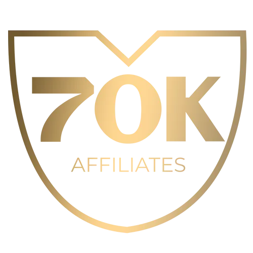

          

          
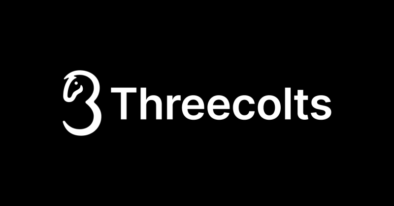

          
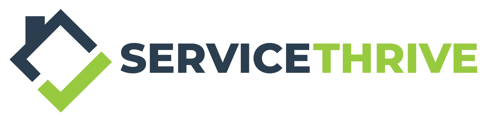

          
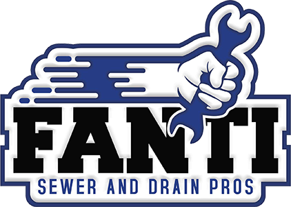

          

          
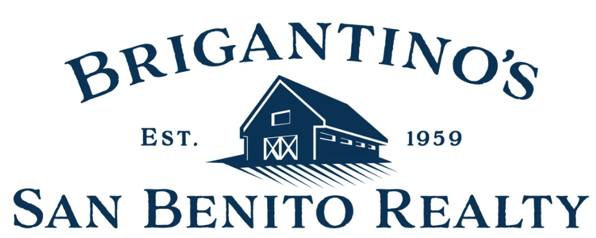

          
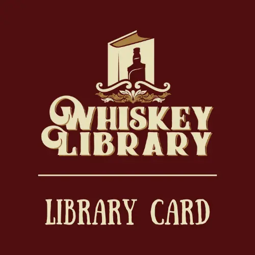

          
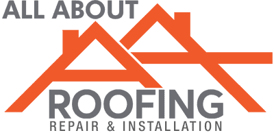

          
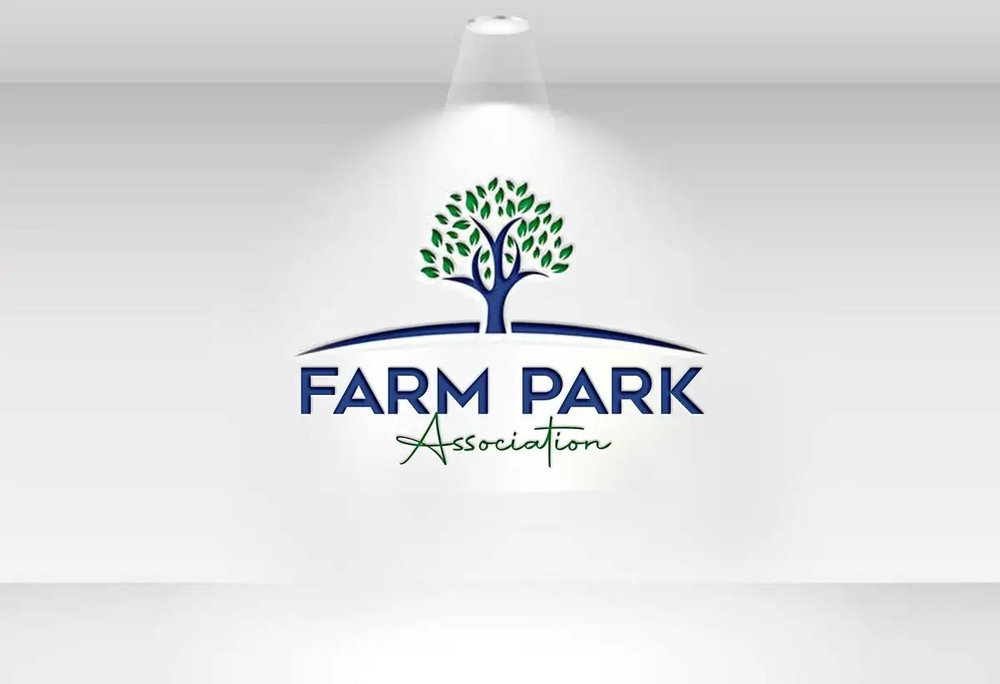

          

          
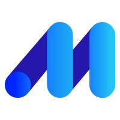

          
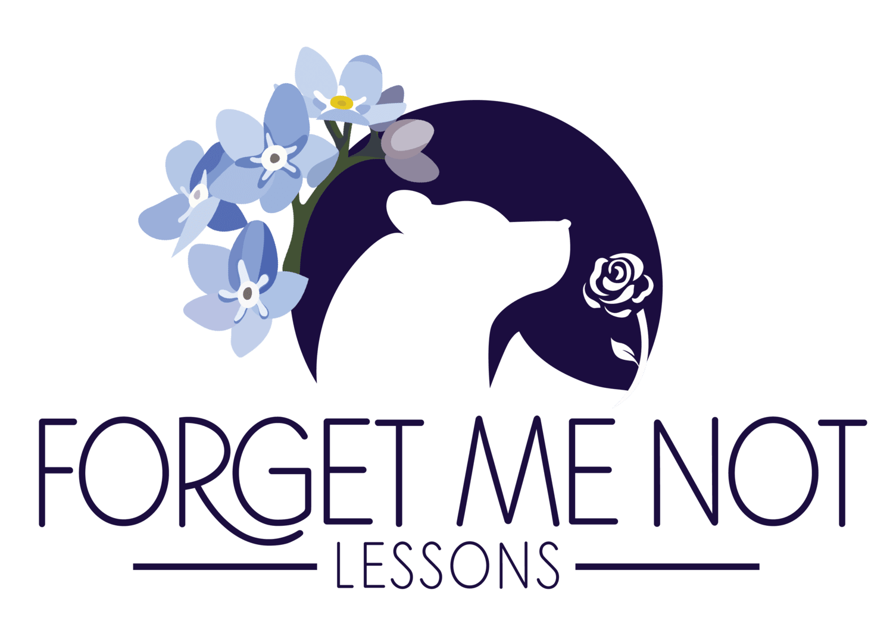

          
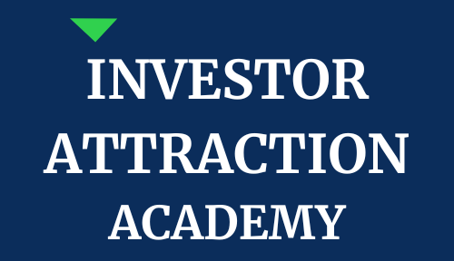

          

          
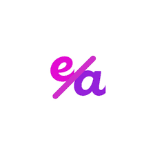

          

          

          

          

          

          

          

          

          

          

          

          

          

          

          

          

        

      

    </section>

    <section class="section" id="testimonials">
      <h2 class="section-title">🎥 Testimonials</h2>
      
Social proof from collaborators and clients who have seen how I work.

      

        

          <h3>Sean Elias — Threecolts / 70K Affiliates</h3>
          
“Jane is really good at getting things done fast.”

          <a class="btn btn-secondary" href="./Sean%20Elias-TestimonialVideo.mp4">▶ Watch video</a>
        

        

          <h3>Joe Remington — PPC Professor</h3>
          
“Jane is a phenomenal resource for me and my team.”

          <a class="btn btn-secondary" href="./Joe-Remington-TestimonialVideo.mp4">▶ Watch video</a>
        

      

    </section>

    <section class="section" id="linkedin">
      <h2 class="section-title">🔗 LinkedIn</h2>
      
Another way to connect and review my professional background in account management, project delivery, client success, and systems optimization.

      

        <h3>Connect with me on LinkedIn</h3>
        
View my profile directly or use the embedded badge below if your GitHub Pages setup supports it.

        
<a class="btn btn-light" href="https://ph.linkedin.com/in/jyugtan?trk=profile-badge" target="_blank" rel="noopener">View my LinkedIn profile</a>

        
<a class="badge-base__link LI-simple-link" href="https://ph.linkedin.com/in/jyugtan?trk=profile-badge">Jane Y.</a>

      

    </section>

    <section class="section" id="contact">
      <h2 class="section-title">📬 Contact</h2>
      
If my background and services align with what you need, I’d be glad to connect and discuss how I can support your business.

      

        <h3>Let’s connect</h3>
        
I’m currently focused on account management, client retention, enterprise renewals, Notion systems, operational support, and AI-assisted workflow improvement for growing businesses.

        

          <a class="btn btn-primary" href="https://calendly.com/jyugtan/discovery-call-with-jane" target="_blank" rel="noopener">☕ Book a quick virtual coffee</a>
          <a class="btn btn-secondary" href="mailto:yugtanlynette@gmail.com">📩 Email me directly</a>
        

      

    </section>

    
© 2026 JNugdan — Account Manager | Project Manager | Executive Assistant

  </main>

  

    

      <button class="project-modal-close" id="projectModalClose" aria-label="Close project details">×</button>
      

    

  

  
  
</body>
</html>
