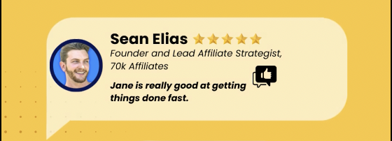
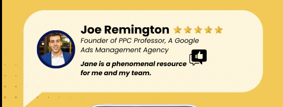

  

<h1 align="center" style="margin-bottom:0;">Jane Yugtan</h1>

<b>Account Manager | Project Manager | Executive Assistant</b>

  <a href="#video-intro">Video Intro</a> · 
  <a href="#results">Results</a> · 
  <a href="#core-focus">Core Focus</a> · 
  <a href="#services">Services</a> ·
  <a href="#featured-projects">Featured Projects</a> ·
  <a href="#demos">Demos</a> · 
  <a href="#experience">Experience</a> · 
  <a href="#clients">Clients</a> · 
  <a href="#testimonials">Testimonials</a> · 
  <a href="#certifications">Certifications</a> · 
  <a href="#linkedin">LinkedIn</a> ·
  <a href="#contact">Contact</a>

  <a href="https://calendly.com/jyugtan/discovery-call-with-jane" target="_blank" rel="noopener" aria-label="Book a quick virtual coffee">☕ Book a quick virtual coffee</a>

  
  
  

<i>I help founders, agencies, and B2B teams strengthen client retention, improve delivery systems, automate operations, and grow revenue through account management, enterprise renewals, Notion systems, and AI-powered workflows.</i>

## 🎥 Meet Jane: Your Partner in Client Success, Systems & Growth

  <a href="https://www.loom.com/share/6325ce02a04148188bf5de8a8e26732b?sid=54f70cf0-e26a-4e4c-9abf-9808cce40351" target="_blank" rel="noopener" style="text-decoration:none; color:#0f172a;" aria-label="Watch Jane's introduction video">
    

      

        
        

          ▶️
        

        

          2:00
        

      

      

        <h3 style="color:#0f4c75; margin:0 0 12px 0; font-size:20px; font-weight:800;">👋 Get to Know Jane</h3>
        

          Watch this quick introduction to see how I support enterprise accounts, agency owners, and growing teams through client success, account management, process optimization, and operational systems.
        

        

          ▶️
          Watch Introduction Video
        

      

      

        

          <strong>Ready to connect?</strong> 
          <a href="https://calendly.com/jyugtan/discovery-call-with-jane" style="color:#0f4c75; text-decoration:none; font-weight:600;">Book your virtual coffee ☕</a>
        

      

    

  </a>

  "I bring together client-facing strategy, execution, and systems so businesses can retain clients, reduce chaos, and scale more sustainably."

<a href="#top">Back to top ↑</a>

## 🔎 Results at a Glance

- **$100,000+** in enterprise renewals processed
- **64.3% renewal close rate** across tracked renewal opportunities
- **18 enterprise renewals closed**
- Added as an account manager in email communications sent to **185,000+ global subscribers**
- **$10K+** affiliate revenue in the **first 30 days** with **$0 ad spend**
- **-87%** onboarding time (**3 days → 4 hours**)
- **95%** new-hire satisfaction improvement from workflow and systems improvements
- **-30%** project delays via QA gates, automation, and delivery structure
- **5–6 hrs/mo** founder time saved through reporting and status automation

<a href="#top">Back to top ↑</a>

## 🧭 Core Focus

**Account Management & Client Success**
- Enterprise renewal management, retention support, and client relationship ownership
- Revenue protection through proactive follow-up, renewal processing, stakeholder coordination, and structured communication
- B2B relationship management focused on trust, continuity, and account growth

**Project Management & Operations**
- Roadmaps, sprint tracking, QA, documentation, and delivery systems in **Notion**, **ClickUp**, and Google Workspace
- SOPs, dashboards, process design, team coordination, and execution support for founders and operators

**Automation & AI Integration**
- Workflow automation for agency owners and contractor-led businesses in the US
- AI-assisted B2B outreach systems, admin support workflows, and operational process optimization
- Practical automation focused on saving time, reducing manual tasks, and increasing consistency

<a href="#top">Back to top ↑</a>

## 🛠 Services

  

    
Account Management & Client Retention

    <ul style="margin:0 0 0 18px; color:#334155; font-size:14px;">
      <li>Enterprise renewals and account coordination</li>
      <li>Client communication and retention support</li>
      <li>Revenue-focused follow-up and relationship management</li>
    </ul>
  

  

    
Notion Dashboard Optimization

    <ul style="margin:0 0 0 18px; color:#334155; font-size:14px;">
      <li>Company-wide Notion architecture and cleanup</li>
      <li>Department dashboards, SOP libraries, and KPI systems</li>
      <li>Founder-friendly operating systems for teams</li>
    </ul>
  

  

    
AI + Automation for Agencies & B2B Outreach

    <ul style="margin:0 0 0 18px; color:#334155; font-size:14px;">
      <li>AI-assisted outreach workflows for B2B organizations</li>
      <li>Automation of repetitive admin and reporting tasks</li>
      <li>Systems that support agency owners and lean teams</li>
    </ul>
  

I work best with founders, agency owners, consultants, e-commerce operators, and service businesses that need stronger systems, cleaner delivery, better follow-up, and more consistent client retention.

<a href="#top">Back to top ↑</a>

## 📌 Featured Projects

### <b>SAVA Amsterdam</b> — Company-Wide Notion Dashboard Optimization

Designed and proposed a full Notion workspace optimization for an e-commerce company, focused on transforming Notion into a clean, scalable company operating system.

- Built a structure designed to help teams find what they need in under 30 seconds
- Organized company-wide dashboards across departments such as Sales, Customer Support, HR, Supply Chain/Production, and Marketing
- Centralized SOPs, KPIs, and operational documents into one searchable system
- Structured the workspace to improve adoption, governance, and day-to-day execution
- Focused on founder-friendly visibility, long-term usability, and cross-functional coordination

### <b>Agency Support for US Contractor Businesses</b> — Operations + Automation

Supported agency owners serving contractors in the US by simplifying repetitive workflows, tightening task coordination, and implementing practical automations.

- Reduced manual admin work through automation-first thinking
- Supported smoother internal coordination and follow-up systems
- Helped organize workflows that improve delivery visibility and team accountability

### <b>B2B Outreach + AI Workflow Support</b> — Sales Enablement

Implemented AI-assisted workflows to support outreach, follow-up, and admin-heavy sales tasks for B2B targeting and organizational prospecting.

- Built systems that help reduce manual outreach preparation
- Improved repeatability and consistency in outbound support workflows
- Focused on sales support, relationship-building, and process efficiency rather than generic automation

<a href="#top">Back to top ↑</a>

## 🎬 Demo Walkthroughs

  <a href="https://www.loom.com/share/f883c45c953848fca179d3bc8724875f?sid=d8f6f443-d770-473d-b4ae-b3fe70d53e16" style="flex:1 1 360px; text-decoration:none; color:#0f172a;" aria-label="Watch Affiliate Program demo">
    

      

        
        ▶
      

      

        
Affiliate Program — Notion &amp; GoHighLevel

        

          <b>Outcome:</b> Scaled to <b>$12K</b> with <b>$0 ad spend</b>; replaced spreadsheets with a data-driven pipeline; saved CEO ~<b>2 hrs/week</b>.
        

        <ul style="margin:0 0 10px 18px; color:#334155; font-size:14px;">
          <li>Automated status, payouts, and comms</li>
          <li>Built repeatable SOPs and handoff workflows</li>
          <li>Improved visibility across marketing and operations</li>
        </ul>
        ▶ Watch demo
      

    

  </a>

  <a href="https://www.loom.com/share/5aa9f903245a482dbbebb103931f1408?sid=c71648f4-3d88-49a5-bed6-65d787dd9dfe" style="flex:1 1 360px; text-decoration:none; color:#0f172a;" aria-label="Watch Talent & Hiring Pipeline demo">
    

      

        
        ▶
      

      

        
Talent &amp; Hiring Pipeline — Notion

        

          <b>Outcome:</b> Onboarding compressed from ~<b>3 days → 4 hours</b>; removed last-minute approvals with stages and automations.
        

        <ul style="margin:0 0 10px 18px; color:#334155; font-size:14px;">
          <li>Role scorecards, structured interviews, and onboarding flows</li>
          <li>Automated candidate communications and status transitions</li>
          <li>Created a repeatable hiring and onboarding process</li>
        </ul>
        ▶ Watch demo
      

    

  </a>

<a href="#top">Back to top ↑</a>

## 🗂 Experience (Selected)

### Account Manager — <b>E-Learning Provider / Enterprise Subscription Accounts</b> <i>(Current)</i>
- Processed **$100,000+ in renewals** across high-value enterprise subscription accounts
- Achieved a **64.3% renewal close rate** based on tracked renewal decisions
- Closed **18 renewal accounts**
- Supported enterprise relationships through renewal follow-up, account coordination, and client communication
- Included as an account manager in marketing-facing email signatures and communications reaching **185,000+ global individual subscribers**
- Focused on retention, renewal continuity, client experience, and revenue preservation

### Project Manager — <b>Whiskey Library</b> <i>(2025)</i>
- Launched a data-driven affiliate engine generating **$10K+ in the first 30 days**
- Automated outreach, tracking, and operational systems
- Reduced onboarding time and improved founder visibility through Notion-based workflows

### Project Manager — <b>ServiceThrive</b> <i>(2024–2025)</i>
- Built execution plans, QA processes, and workflow structures for delivery support
- Proposed scalable systems and removed operational blockers
- Supported stronger execution consistency across moving projects

### Project Manager — <b>The Social Brand</b> <i>(2023–2024)</i>
- Managed 6 full-stack web and SEO projects with an average launch timeline of **1.8 months**
- Reduced rework by **30%** through ClickUp-first QA and workflow improvements
- Maintained strong communication cadence and client-facing project visibility

### EA / OBM — <b>Investor Attraction Academy</b> <i>(2023–2024)</i>
- Supported founder operations through inbox, calendar, scheduling, and client communication
- Managed follow-up, reporting, meeting coordination, and execution support
- Helped maintain SLA consistency and operational organization

<a href="#top">Back to top ↑</a>

## 🤝 Clients & Websites Managed

  
  
  
  
  
  
  
  
  
  
  
  
  
  
  
  

<a href="#top">Back to top ↑</a>

## 🎥 Testimonials

  <a href="./Sean%20Elias-TestimonialVideo.mp4" style="flex:1 1 340px; text-decoration:none; color:#0f172a;" aria-label="Watch testimonial from Sean Elias">
    

      

        
      

      

        
Sean Elias — Threecolts / 70K Affiliates

        
"Jane is really good at getting things done fast."

        ▶ Watch video
      

    

  </a>

  <a href="./Joe-Remington-TestimonialVideo.mp4" style="flex:1 1 340px; text-decoration:none; color:#0f172a;" aria-label="Watch testimonial from Joe Remington">
    

      

        
      

      

        
Joe Remington — PPC Professor

        
"Jane is a phenomenal resource for me and my team."

        ▶ Watch video
      

    

  </a>

<a href="#top">Back to top ↑</a>

## 🏅 Certifications

  
    
    
<b>ClickUp Verified Power User (v3)</b> — 2025

  
  
    
    
<b>HubSpot SEO Certification</b> — 2024

  

<a href="#top">Back to top ↑</a>

## 🔗 Connect on LinkedIn

You can also connect with me directly on LinkedIn to view my background in account management, client success, project management, and systems optimization.

  <a href="https://ph.linkedin.com/in/jyugtan?trk=profile-badge" target="_blank" rel="noopener">
    View my LinkedIn Profile
  </a>

  <a class="badge-base__link LI-simple-link" href="https://ph.linkedin.com/in/jyugtan?trk=profile-badge">Jane Y.</a>

<a href="#top">Back to top ↑</a>

## 📬 Contact

I’m currently focused on account management, client retention, enterprise renewals, Notion systems, operational support, and AI-assisted workflow improvement for growing businesses.

If my services are aligned with what you’re looking for, I’d be glad to connect and discuss how I can support your team.

  <a href="https://calendly.com/jyugtan/discovery-call-with-jane" style="display:inline-block; padding:12px 16px; background:#1a1a2e; color:#fff; text-decoration:none; border-radius:12px; font-weight:700;">☕ Book a quick virtual coffee</a>

  <a href="mailto:yugtanlynette@gmail.com" style="display:inline-block; padding:12px 16px; background:#0f4c75; color:#fff; text-decoration:none; border-radius:12px; font-weight:700;">📩 Email Me Directly</a>

© 2025 Jane Yugtan — Account Manager | Project Manager | Executive Assistant

