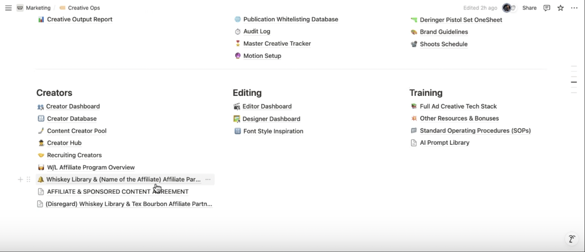
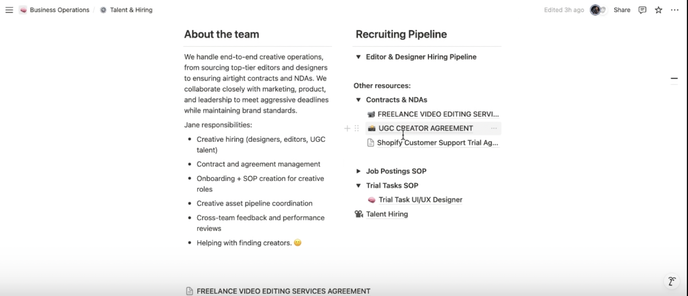

<html lang="en">
<head>
  <meta charset="UTF-8" />
  <meta name="viewport" content="width=device-width, initial-scale=1.0" />
  <title>Jane Yugtan | Account Manager | Project Manager | Executive Assistant</title>
  
</head>
<body>
  

    

      
Jane Yugtan

      <nav class="nav">
        <a href="#video-intro">Video</a>
        <a href="#results">Results</a>
        <a href="#services">Services</a>
        <a href="#featured-projects">Projects</a>
        <a href="#pricing">Ways I Work</a>
        <a href="#testimonials">Testimonials</a>
        <a href="#about">About</a>
        </nav>
    

  

  <main class="container">
    <section class="hero" id="top">
      

        

          
        

        

          
Client Retention • Systems • Revenue Operations

          <h1>Jane Yugtan</h1>
          
Account Manager | Project Manager | Executive Assistant

          

            I help founders, agencies, and B2B teams improve client retention, strengthen delivery systems, automate operations, and support revenue growth through account management, enterprise renewals, Notion systems, and AI-powered workflows.
          

          

            <a class="btn btn-primary" href="https://calendly.com/jyugtan/discovery-call-with-jane" target="_blank" rel="noopener">☕ Book a quick virtual coffee</a>
            <a class="btn btn-secondary" href="mailto:yugtanlynette@gmail.com">📩 Email Me</a>
            <a class="btn btn-light" href="https://www.linkedin.com/in/jyugtan/" target="_blank" rel="noopener">🔗 LinkedIn</a>
          

        

      

    </section>

    <section class="section reveal" id="video-intro">
      <h2 class="section-title">🎥 Meet Jane</h2>
      
This quick introduction gives you context before you explore the portfolio below, including the kind of work I do, the teams I support, and what you’ll find on this page.

      

        <a class="video-thumb" href="#" id="openIntroVideo" aria-label="Watch Jane's introduction video">
          
          
▶

          
Watch My Introduction

        </a>
        

          <h3>A quick introduction before you explore my portfolio</h3>
          

            In this short video, I introduce myself, share the kind of work I do across account management, project delivery, and systems optimization, and walk you through what you can expect to see throughout this one-page portfolio.
          

        

      

    </section>

    <section class="section reveal" id="results">
      <h2 class="section-title">🔎 Results at a Glance</h2>
      
A cleaner KPI layout to highlight the outcomes most relevant to account management, automation, and systems design.

      

        

          
$100K+

          
Enterprise renewals processed

          
Managed renewal processing across high-value subscription accounts with a focus on retention, continuity, and account health.

        

        

          
135K+

          
Global subscribers reached

          
Included as an account manager in subscriber-facing email communications for a large global B2C audience.

        

        

          
$10K

          
Affiliate pipeline in 30 days

          
Built a qualified affiliate pipeline and supporting workflow structure for Whiskey Library in the first 30 days.

        

        

          
-87%

          
Onboarding time reduced

          
Reduced onboarding from approximately 3 days to 4 hours through structured systems and automation.

        

        

          
95%

          
Workflow satisfaction improvement

          
Supported stronger team experience through cleaner systems, visibility, and documentation.

        

        

          
-30%

          
Project delays reduced

          
Improved execution through QA gates, process control, and more predictable delivery workflows.

        

        

          
6–10 hrs

          
CEO time saved weekly

          
Automation, clearer systems, and structured workflows freed up leadership time each week.

        

        

          
100+

          
Client accounts supported

          
Supported client delivery and operations across agencies, founders, and the businesses they served.

        

      

      

        
🔎

        

          <h3>$100K+ in enterprise renewals</h3>
          

            This metric reflects renewal processing across high-value subscription accounts, with a strong focus on revenue retention, account continuity, and client relationship management. Click the KPI card again or use the button below to minimize this view.
          

          <button class="metric-close" id="renewalsCalloutClose" type="button">Close highlight</button>
        

      

    </section>

    <section class="section reveal" id="services">
      
      <h2 class="section-title">🛠 Services</h2>
      
Here are the core ways I support founders, agencies, and growing teams through retention, systems optimization, and automation.

      

        

          
🤝

          <h3>Account Management & Client Retention</h3>
          <ul>
            <li>Enterprise renewals and retention support</li>
            <li>Client communication, follow-up, and relationship management</li>
            <li>Revenue-focused coordination for ongoing accounts</li>
          </ul>
          

            Renewals
            Retention
            Client Success
          

        

        

          
🧩

          <h3>Notion Dashboard Optimization</h3>
          <ul>
            <li>Company-wide Notion architecture and dashboard cleanup</li>
            <li>Department dashboards, SOP libraries, and KPI systems</li>
            <li>Founder-friendly systems that improve visibility and usability</li>
          </ul>
          

            Notion Systems
            Operations
            Documentation
          

        

        

          
⚙️

          <h3>AI + Automation for Agencies & B2B Teams</h3>
          <ul>
            <li>AI-assisted outreach workflows for B2B companies and organizations</li>
            <li>Automation of repetitive admin, reporting, and coordination work</li>
            <li>Process improvement for agencies and contractor-focused businesses</li>
          </ul>
          

            AI Workflows
            Automation
            B2B Outreach
          

        

      

    </section>

    <section class="section reveal" id="notion-demos">
      

        <h2 class="section-title">🎬 Notion Systems & Automation Demos</h2>
        
Below are short walkthroughs of systems I built in Notion and integrated tools. I replaced the static Loom thumbnails with custom branded previews so the section feels more polished and consistent with the rest of the site.

        

          

            
System Walkthrough

            <h3>Affiliate Operations Automation Dashboard</h3>
            
This walkthrough shows the creator and affiliate pipeline I designed using Notion and GoHighLevel to organize outreach, manage creator partnerships, and track program performance.

            

              Notion Automation
              Affiliate Pipeline
              Creator Outreach
            

            

              <a href="https://www.loom.com/share/f883c45c953848fca179d3bc8724875f" target="_blank" rel="noopener" style="display:block; position:relative; text-decoration:none;">
                
                

                
▶

                
Watch Loom Demo

              </a>
            

            
In this demo I explain how the affiliate program pipeline, creator database, outreach automation, and tracking system were structured to generate revenue without paid ads.

          

          

            
System Walkthrough

            <h3>Talent & Hiring Pipeline Workflow</h3>
            
A walkthrough of the hiring and candidate management workflow built in Notion to streamline candidate tracking, interviews, and onboarding preparation.

            

              Notion Database
              Hiring Pipeline
              Operations Workflow
            

            

              <a href="https://www.loom.com/share/5aa9f903245a482dbbebb103931f1408" target="_blank" rel="noopener" style="display:block; position:relative; text-decoration:none;">
                
                

                
▶

                
Watch Loom Demo

              </a>
            

            
This demo explains how the hiring pipeline organizes candidates, status tracking, and communication flow for smoother recruitment coordination.

          

        

      

    </section>
    <section class="section reveal" id="featured-projects">
      <h2 class="section-title">📌 Featured Projects</h2>
      
These are two projects I’m proud to highlight because they reflect how I think, what I build, and how I support growth through systems and execution.

      

        

          

            

              

              
https://sava-amsterdam.com/

            

            

              

                
🌐 Live Website

                <a href="https://sava-amsterdam.com/" target="_blank" rel="noopener" class="btn btn-light">Visit Website ↗</a>
              

            

          

          <h3>SAVA Amsterdam</h3>
          
Full company Notion system

          
Company-wide Notion dashboard optimization concept designed for cleaner operations, better visibility, and a more scalable workspace structure.

          

            What this project focused on
            E-commerce Ops
            Company Systems
          

        

        

          

            

              

              
https://whiskeylibrary.com/

            

            

              

                
🌐 Live Website

                <a href="https://whiskeylibrary.com/" target="_blank" rel="noopener" class="btn btn-light">Visit Website ↗</a>
              

            

          

          <h3>Whiskey Library</h3>
          
$10K pipeline in 30 days

          
Affiliate pipeline and Notion workflow build focused on early-stage growth, visibility, and a more organized affiliate operations structure.

          

            What this project focused on
            Affiliate Ops
            Notion Workflow
          

        

      

    </section>

    <section class="section reveal" id="pricing">
      

        <h2 class="section-title">💼 Ways I Work With Clients</h2>
        
I turned this into a cleaner continuous gallery so visitors can keep browsing in either direction, then click any card to expand the details.

        

          <button class="carousel-arrow left" type="button" id="pricingPrev" aria-label="Previous">‹</button>
          

            

              

                
⏱

                <h3>Hourly Support</h3>
                
For ongoing operational, project, or account management support.

                <ul>
                  <li><strong>$15–$20 / hour</strong></li>
                  <li>Ideal for agencies and founders needing flexible support</li>
                </ul>
              

              

                
🧩

                <h3>Notion System Projects</h3>
                
Company-wide Notion dashboards, operations systems, and workflow design.

                <ul>
                  <li><strong>Starts at $1,500 / month</strong></li>
                  <li>Includes planning, system design, and implementation</li>
                </ul>
              

              

                
🔧

                <h3>Maintenance & Retainers</h3>
                
Post-project maintenance, optimization, and system support.

                <ul>
                  <li><strong>Starts at $500 / month</strong></li>
                  <li>Ideal for teams needing ongoing updates</li>
                </ul>
              

              

                
📊

                <h3>Consulting Sessions</h3>
                
Strategic sessions focused on systems, operations, and workflow optimization.

                <ul>
                  <li><strong>$50 / hour</strong></li>
                  <li>Includes a follow-up SOP or action guide</li>
                </ul>
              

            

          

          <button class="carousel-arrow right" type="button" id="pricingNext" aria-label="Next">›</button>
        

      

    </section>

    <section class="section reveal" id="testimonials">
      <h2 class="section-title">🎥 Testimonials</h2>
      
Social proof from collaborators and clients who have seen how I work.

      

        

          <h3>Sean Elias — Threecolts / 70K Affiliates</h3>
          
“Jane is really good at getting things done fast.”

          <a class="btn btn-secondary" href="./Sean%20Elias-TestimonialVideo.mp4">▶ Watch video</a>
        

        

          <h3>Joe Remington — PPC Professor</h3>
          
“Jane is a phenomenal resource for me and my team.”

          <a class="btn btn-secondary" href="./Joe-Remington-TestimonialVideo.mp4">▶ Watch video</a>
        

      

    </section>

    <section class="section reveal" id="about">
      <h2 class="section-title">👋 About Me</h2>
      
A little about my story, how I started working remotely, and why this work matters to me.

      

        

          
My Story

          <h3>Working remotely since 2021</h3>
          
I started working remotely in 2021, and in 2022 I landed my first real project supporting a marketing agency in the United States. Since then everything shifted.

          
Over the past few years I’ve helped marketing agencies and founders improve operations, organize systems, and support their client relationships. Along the way I’ve worked with around <strong>10 amazing clients</strong> and indirectly supported <strong>100+ of their clients</strong> through project delivery, systems work, and account management.

          
My work now focuses on helping teams save time, streamline processes, and build systems that make daily operations easier.

        

        

          
Current Focus

          <h3>What I’m focused on today</h3>
          
I currently work as an <strong>Account Manager for an e-learning provider</strong>, where I support client relationships, account continuity, and renewal coordination while continuing to help teams improve systems and day-to-day operations.

          
I’m most energized by work that saves people time, creates clarity, and helps teams move faster without sacrificing quality.

        

        

          
Fun Fact

          <h3>Life outside work</h3>
          
I love traveling around the Philippines, especially beach destinations. I enjoy sunsets, good conversations, and ending the day with a cocktail.

          
I also love cats and exploring new places around my country. Working remotely allows me to do work I enjoy while still experiencing the world around me.

          
        

      

    </section>

    <section class="section reveal" id="contact">
      

        <h3>Let’s connect ☕</h3>
        
If my background and services align with what you need, I’d be glad to connect and discuss how I can support your business.

        

          <a class="btn btn-light" href="https://calendly.com/jyugtan/discovery-call-with-jane" target="_blank" rel="noopener">☕ Book a quick virtual coffee</a>
        

      

    </section>

    
© 2026 Jane Yugtan — Account Manager | Project Manager | Executive Assistant

  </main>

  

    

      <button class="project-modal-close" id="introVideoModalClose" aria-label="Close intro video">×</button>
      

        
Meet Jane

        <h3 style="margin-bottom:8px;">A quick introduction to my portfolio</h3>
        
This short video shares who I am, the kind of work I do, and what you’ll find throughout this portfolio before you continue scrolling.

      

      

        <iframe id="introVideoFrame" src="" title="Jane portfolio introduction video" allowfullscreen style="position:absolute; inset:0; width:100%; height:100%; border:0;"></iframe>
      

    

  

  

    

      <button class="project-modal-close" id="projectModalClose" aria-label="Close project details">×</button>
      

    

  

  
  
</body>
</html>
