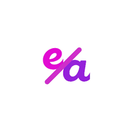

<h1 align="center">Jane Yugtan</h1>

<b>Project Manager & Executive Assistant</b>

  
  
  

  <i>I translate founder vision into systems, sprints, and measurable outcomes across Marketing, Web, and Ops. Formal, metrics-driven, and results-focused.</i>

---

## 🔎 Results at a Glance
- **$10K+** affiliate revenue in the **first 30 days** (zero ad spend).
- **-87%** onboarding time (3 days → **4 hours**).
- **95%** new-hire satisfaction (from ~60%).
- **-30%** project delays via ClickUp QA gates & automation.
- **5–6 hrs/mo** founder time saved with reporting & status automation.

---

## 🧭 Core Focus — PM & EA
**Project Management**
- Roadmaps → sprints → QA in **ClickUp** and **Notion**.
- SOPs, RACI, risk registers, and KPI dashboards for predictable throughput.

**Executive Assistant**
- Inbox & calendar control; stakeholder comms; meeting notes → actionable tasks.
- Renewal hygiene, structured follow-ups, and executive-ready reporting cadence.

---

## 🗂 Experience (Selected)
### Project Manager — **Whiskey Library** *(2025)*
- Launched data-driven affiliate engine: **$10K+ in 30 days**.
- Automated outreach & tracking; onboarding time **-87%**.
- **-30%** delays; **5–6 hrs/mo** founder time saved.

### Project Manager — **ServiceThrive** *(2024–2025)*
- Built execution plans and QA; improved delivery productivity.
- Proposed scalable systems; removed operational blockers.

### Project Manager — **The Social Brand** *(2023–2024)*
- Managed 6 full-stack web & SEO projects (avg. **1.8 months** to launch).
- Reduced rework **-30%** via ClickUp-first QA; **95% CSAT** on updates.

### EA / OBM — **Investor Attraction Academy** *(2023–2024)*
- Founder support (inbox/calendar, client comms, scheduling).
- Automated sequences; maintained SLAs & satisfaction.

---

## 🤝 Clients & Websites Managed

  <!-- row 1 -->
  
    
  
  
    
  
  
    
  
  
    
  
  <!-- row 2 -->
  
    
  
  
    
  
  
    
  
  
    
  
  
    
  
  <!-- row 3 -->
  
    
  
  
    
  
  
    
  
  
    
  
  
    
  
  <!-- row 4 -->
  
    
  
  
    
  
  
    
  

---

## 🎥 Testimonials (quote preview + video link)
<!-- Two highlight cards with quotes + CTA buttons -->

  

    
Sean Elias — Threecolts / 70K Affiliates

    
“Jane is really good at getting things done fast.”

    <a href="./Sean%20Elias-TestimonialVideo.mp4" style="display:inline-block; padding:10px 14px; background:#0f4c75; color:#fff; text-decoration:none; border-radius:10px; font-weight:600;">▶ Watch video</a>
  

  

    
Joe Remington — PPC Professor

    
“Jane is a phenomenal resource for me and my team.”

    <a href="./Joe-Remington-TestimonialVideo.mp4" style="display:inline-block; padding:10px 14px; background:#0f4c75; color:#fff; text-decoration:none; border-radius:10px; font-weight:600;">▶ Watch video</a>
  

---

## 🏅 Certifications

  
    
  
  
    
  

---

## 💬 Contact

